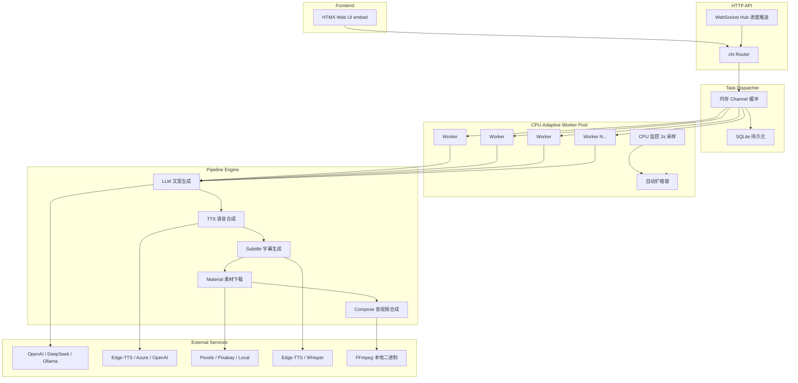

# MoneyPrinterFaster

基于 Go 的短视频自动生成系统，输入主题即可自动完成 LLM 文案生成 → TTS 语音合成 → 字幕生成 → 素材下载 → 音视频合成，最终输出带字幕的 MP4 视频。

## 架构



## 目录结构

```
MoneyPrinterFaster/
├── cmd/server/          # 入口，初始化并启动服务
├── internal/
│   ├── api/             # HTTP 路由、handler、HTML 模板
│   ├── config/          # TOML 配置加载
│   ├── model/           # 数据模型（Task、Params、VideoParams）
│   ├── pipeline/        # 5 步流水线编排
│   ├── queue/           # Channel 队列 + SQLite 持久化
│   ├── service/         # 外部服务集成
│   │   ├── compose/     # FFmpeg 视频合成
│   │   ├── llm/         # LLM 文案生成（OpenAI/DeepSeek/Ollama）
│   │   ├── material/    # 素材下载（Pexels/Pixabay）
│   │   ├── subtitle/    # 字幕生成（Edge/Whisper）
│   │   └── tts/         # 语音合成（Edge/Azure/OpenAI）
│   └── worker/          # CPU 自适应 Worker Pool
├── pkg/utils/           # 通用工具（文件、FFmpeg 路径检测）
├── web/                 # 静态资源 + 前端
├── config.example.toml  # 配置模板
└── Makefile             # 构建脚本
```

## 快速开始

### 依赖

- Go 1.22+
- FFmpeg（需支持 libx264）
- Python 3 + edge-tts（`pip install edge-tts`，首次运行自动安装）

### 配置

```bash
cp config.example.toml config.toml
```

编辑 `config.toml`，填写 API Key：

| 配置项 | 说明 | 必填 |
|--------|------|------|
| `[llm.deepseek].api_key` | DeepSeek API Key | 是（至少配一个 LLM） |
| `[material.pexels].api_keys` | Pexels API Key 列表 | 是（至少一个） |
| `[tts]` | TTS 引擎（默认 edge，无需 Key） | 否 |

### 运行

```bash
# 开发模式
make run

# 编译
make build
./build/moneyprinterFaster

# 交叉编译
make build-darwin
make build-linux
```

启动后访问 `http://localhost:8080`。

### 使用流程

1. 输入视频主题（如"人工智能的未来"）
2. 点击「AI 生成文案」自动生成脚本，或手动填写
3. 调整参数（语言、段落数、视频尺寸、语音等）
4. 点击「提交任务」
5. 任务列表中查看进度，完成后下载 MP4

## 核心特性

- **CPU 自适应 Worker Pool**：根据 CPU 负载自动扩缩容，不会过载
- **SQLite 持久化队列**：服务重启不丢失任务，支持历史任务查询
- **FFmpeg 内存优化**：逐文件标准化 + concat demuxer 流式拼接，避免 OOM
- **字幕双方案**：优先 libass subtitles 滤镜，降级使用 drawtext
- **时长精准控制**：ffprobe 探测真实时长，下载素材不超过音频时长的 110%
